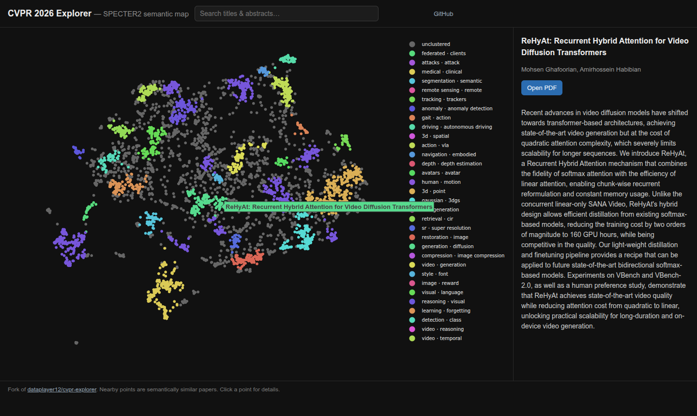
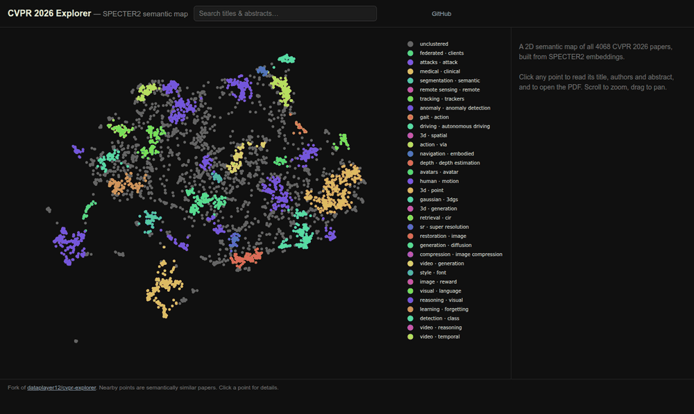
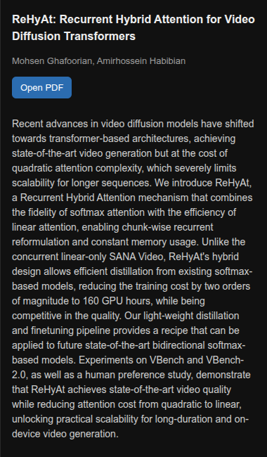

# CVPR 2026 Explorer

A 2D semantic map of all 4068 CVPR 2026 papers, built from
[SPECTER2](https://huggingface.co/allenai/specter2) embeddings of their abstracts.
Nearby points are semantically similar papers, so a cluster is a topic.

**Live site: https://flecomet.github.io/cvpr-explorer/**

Fork of [dataplayer12/cvpr-explorer](https://github.com/dataplayer12/cvpr-explorer), rewritten
for CVPR 2026. See [Credits](#credits).

[](https://flecomet.github.io/cvpr-explorer/)



## Why

Conference sites list 4000+ papers as one flat list. Finding the ones you care about means
scrolling past thousands you don't. Here you zoom into the region of the map you're interested
in, such as diffusion, 3D reconstruction or medical imaging, and read only those papers.

## Reading the map

Each point is one paper. Position comes from the abstract: papers with similar abstracts land
close together. Colours mark topic clusters, and the legend names each one with its most
characteristic terms. Grey points are papers that fit no cluster.

- **Search** matches titles and abstracts and dims every other point, so the shape of the map
  stays visible. The query is stored in the URL, so
  [`?q=diffusion`](https://flecomet.github.io/cvpr-explorer/?q=diffusion) is a shareable link.
- **Click** a point to show the title, authors and abstract in the side panel, with a link to the PDF.
- **Scroll and drag** to zoom and pan.



Distances are approximate. UMAP, the 2D projection method, preserves local neighbourhoods
better than global distances. Read "these two papers are close" as meaningful, and "this
cluster is twice as far away as that one" as unreliable.

## Largest topics

The pipeline finds 32 topic clusters. A further 1477 papers (36%) belong to none of them.
Labels are generated automatically from the abstracts.

| Papers | Cluster label |
|-------:|---------------|
| 277 | 3d · point · view |
| 197 | medical · clinical · image |
| 176 | attacks · attack · adversarial |
| 149 | gaussian · 3dgs · 3d |
| 134 | generation · diffusion · training |
| 122 | action · vla · robot |
| 114 | reasoning · visual · multimodal |
| 112 | 3d · generation · mesh |

## How it works

The pipeline is offline and the site is static.

| Step | Script | Output |
|------|--------|--------|
| Scrape titles, authors, abstracts, PDF links | `scrape.py` | `data/cvpr_2026_papers.json` |
| Embed abstracts with SPECTER2 | `embed.py` | `data/cvpr_2026_specter2.npy` |
| UMAP to 2D, HDBSCAN clusters, c-TF-IDF labels | `layout.py` | `data/cvpr_2026_layout.json` |
| Merge into the site payload | `build_site.py` | `site/data.json` |

`layout.py` runs UMAP on the cosine-normalised embeddings, then HDBSCAN, a density-based
clustering method, on the 2D coordinates. Cluster labels use c-TF-IDF: terms score high when
they are frequent in one cluster and rare in the others.

`site/index.html` renders the payload client-side with plotly.js. No backend and no API keys
are needed at serve time.

## Run the pipeline

```shell
pip install -r requirements-pipeline.txt
python scrape.py     # writes data/cvpr_2026_papers.json
python embed.py      # writes data/cvpr_2026_specter2.npy, GPU recommended
python layout.py     # writes data/cvpr_2026_layout.json
```

## Serve locally

The static site is what the live URL serves:

```shell
python build_site.py
python -m http.server -d site 8000   # http://localhost:8000
```

<details>
<summary>Original Dash app and Docker</summary>

The upstream Dash app is still in the repository:

```shell
pip install -r requirements.txt
python app.py                        # http://localhost:8050
```

With Docker:

```shell
docker compose build
docker compose up
```

</details>

## Deployment

Pushing to `main` runs `.github/workflows/pages.yml`, which rebuilds `site/data.json` and
publishes `site/` to GitHub Pages.

## Roadmap

- [x] SPECTER2 embeddings, an open model that needs no API key
- [x] 2D projection with clusters and automatic topic labels
- [x] Static site with no server and no cold start
- [x] Keyword search across titles and abstracts
- [ ] Mark papers with released code
- [ ] Add more conferences and years back

## Credits

This is a fork of [dataplayer12/cvpr-explorer](https://github.com/dataplayer12/cvpr-explorer)
([cvprexplorer.com](http://cvprexplorer.com)). The fork replaces the OpenAI embeddings with the
open SPECTER2 scientific-document model, adds automatic cluster labels, and serves a static
front-end that needs no server. The original idea and design are by
[@dataplayer12](https://github.com/dataplayer12). Same licence as upstream, see [LICENSE](LICENSE).
